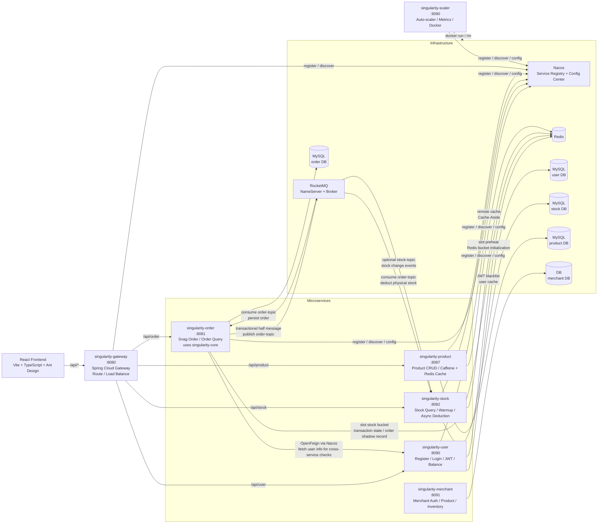
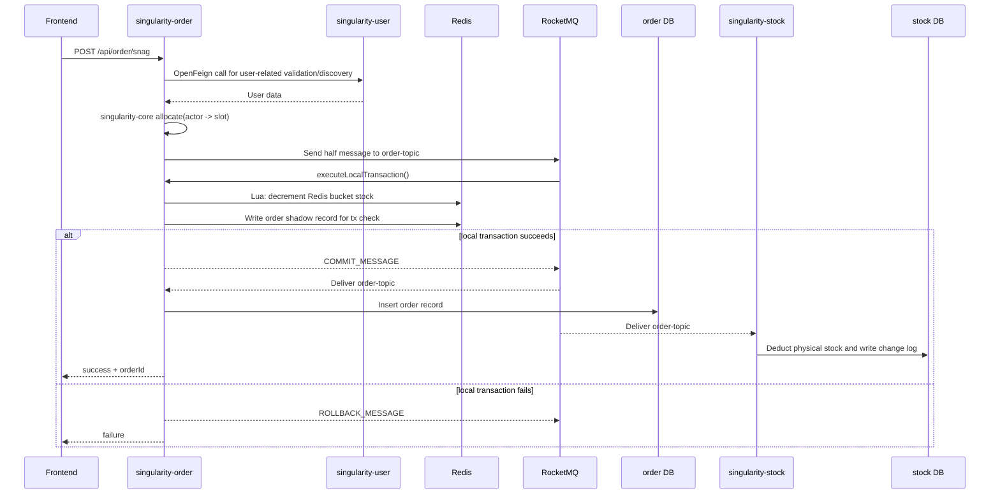

# WHUSingularity Architecture

WHUSingularity is a Spring Cloud based microservice system for a seckill/order-snatching scenario.
The important runtime boundary is the collaboration between `singularity-user`, `singularity-order`, `singularity-stock`, `singularity-product`, and `singularity-merchant`, with `singularity-gateway` as the unified API entry point. Nacos, Redis, RocketMQ, and MySQL serve as shared infrastructure.

`singularity-core` is not an independently deployed service. It is a shared library used mainly by `singularity-order` to implement slot-based high-concurrency allocation.

## Runtime Architecture

## Service Responsibilities

- `singularity-gateway`
  Unified API entry point using Spring Cloud Gateway. Routes requests by path prefix (`/api/user`, `/api/order`, `/api/stock`, `/api/product`) to backend services via Nacos service discovery with client-side load balancing.
- `singularity-user`
  Handles registration, login, JWT issuance, token blacklist, user profile, and balance operations.
- `singularity-order`
  Owns the seckill entrypoint. It uses `singularity-core` to route an actor to a slot, performs Redis-based stock deduction inside a RocketMQ transactional flow, and exposes order query APIs.
- `singularity-stock`
  Owns stock persistence and stock change logs. It also preheats Redis stock buckets and asynchronously updates physical stock after order messages are committed.
- `singularity-product`
  Manages the product catalog (CRUD, search, listing) with a two-level Cache-Aside pattern: Caffeine local cache (5min TTL) → Redis remote cache (detail 30min, list 10min) → MySQL. Includes cache penetration protection via null placeholders.
- `singularity-merchant`
  Self-contained merchant management service. Provides merchant registration/login (independent JWT auth), product catalog management, and inventory tracking with change logs. Operates independently without inter-service calls (default H2 database, optional MySQL via local profile).
- `singularity-scaler`
  Auto-scaler service that monitors CPU/memory/QPS metrics from all healthy instances of core services via Prometheus actuator endpoints, uses resource utilization thresholds with sliding window smoothing for scaling decisions, and manages Docker container lifecycle (start/remove) based on cooldown periods.

## Key Interaction Patterns

- Synchronous interaction
  `singularity-order` calls `singularity-user` through OpenFeign, with service discovery handled by Nacos.
- Asynchronous interaction
  `singularity-order` publishes transactional messages to RocketMQ. Both `singularity-order` and `singularity-stock` consume `order-topic`:
  `singularity-order` persists the order record, while `singularity-stock` deducts the actual stock record.
- Shared fast-path state
  Redis is part of the hot path. Order seckill traffic does not directly compete on MySQL row updates first; it hits Redis bucket stock first, which is critical for high concurrency.
- Persistent state
  Each service keeps its own database boundary: user data in user DB, order data in order DB, stock data in stock DB.

## Seckill Order Flow

## Why This Architecture Matters

- The system separates user, order, and stock concerns into independent services instead of coupling them into one monolith.
- The hottest business path is centered in `singularity-order`, but it offloads durable propagation to RocketMQ and uses Redis to absorb concurrency pressure.
- `singularity-stock` is eventually consistent with the Redis fast path, which is a deliberate design tradeoff for seckill throughput.
- Nacos is the control plane for both service registration and centralized runtime configuration.

## Current Architectural Notes

- `singularity-core` is a framework module embedded into `singularity-order`, not a standalone service.
- `singularity-merchant` is self-contained with its own database and JWT auth; it does not call other services via OpenFeign (Nacos discovery disabled by default in dev).
- `singularity-product` implements a two-level caching strategy (Caffeine + Redis) for high-performance product reads.
- Order status progression is still limited in the current implementation: the order consumer persists orders with status `CREATED`, and there is not yet a full downstream state machine for payment/cancel/final success transitions.
