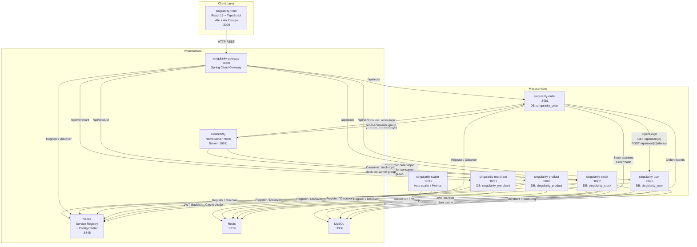
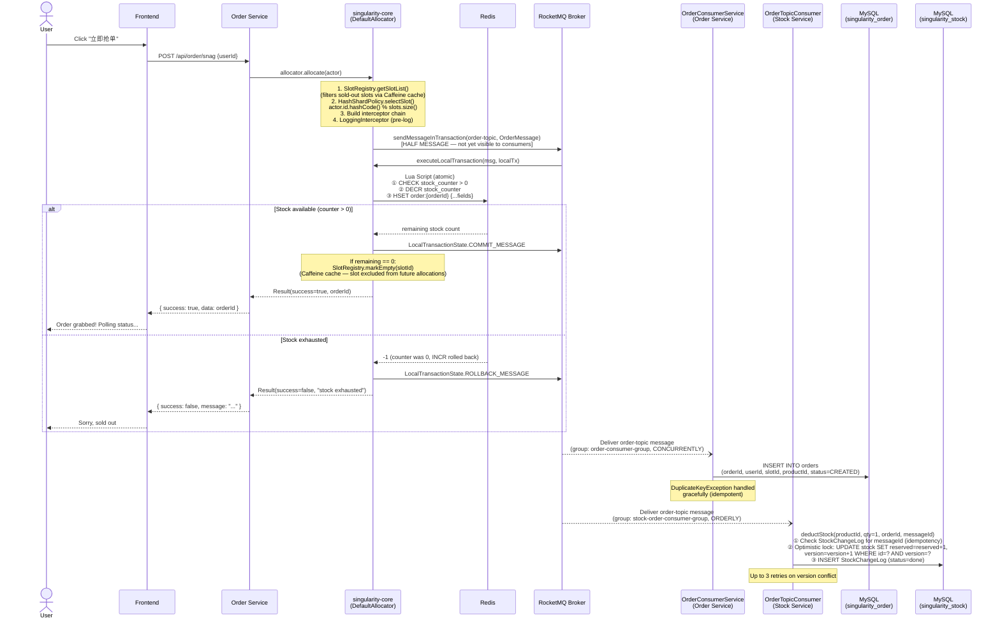
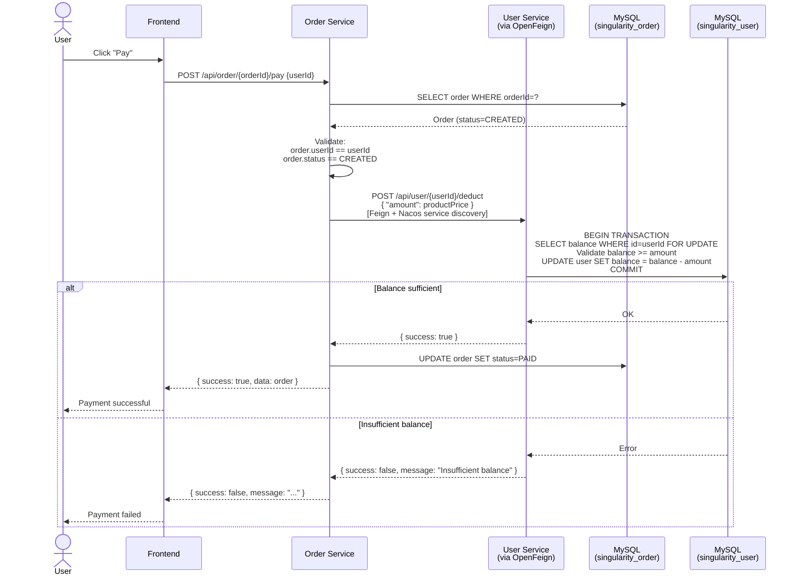
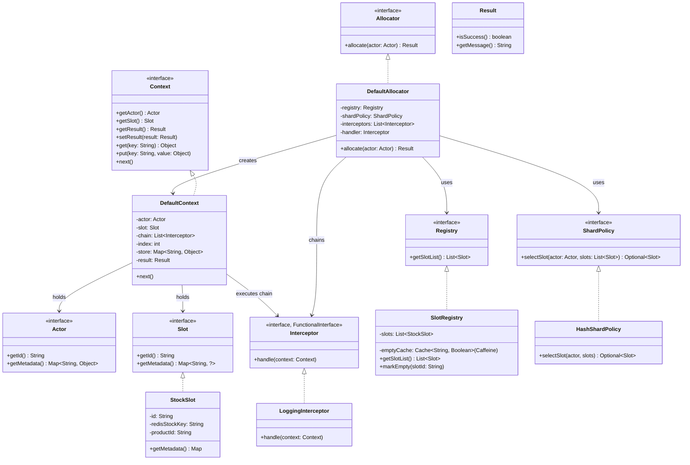
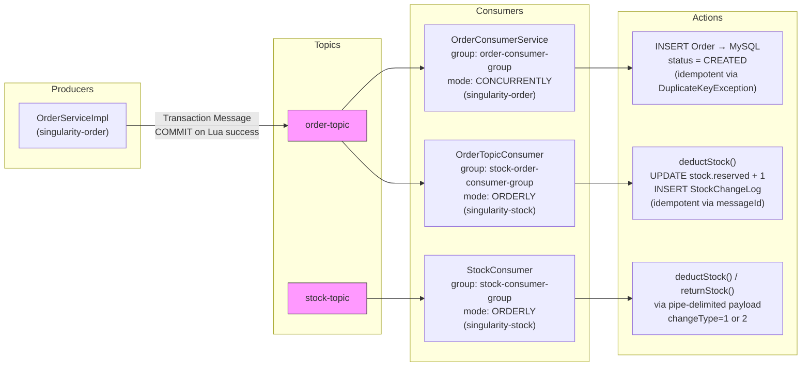
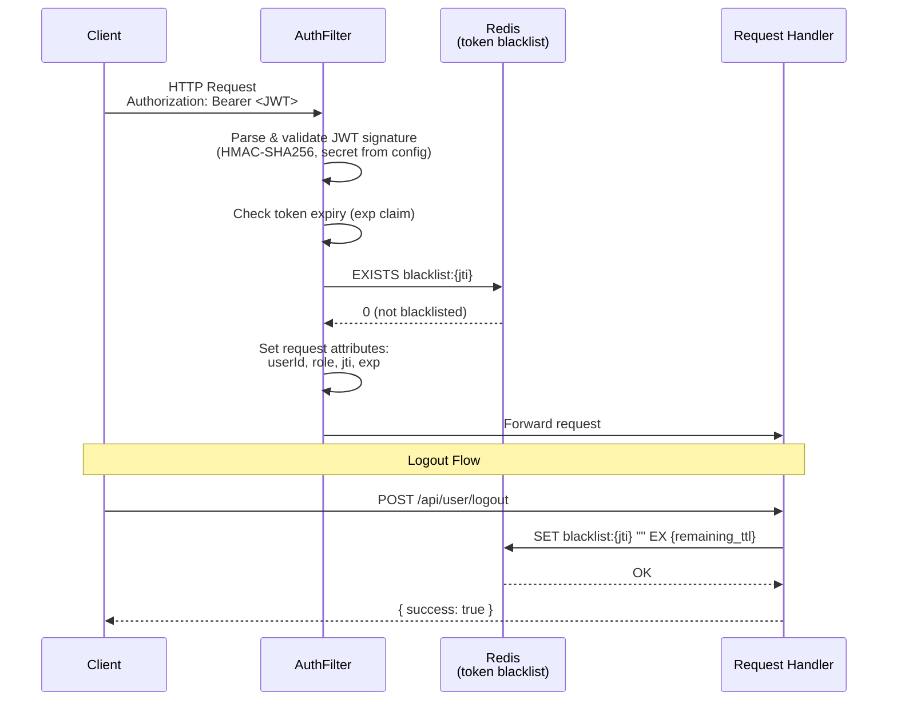
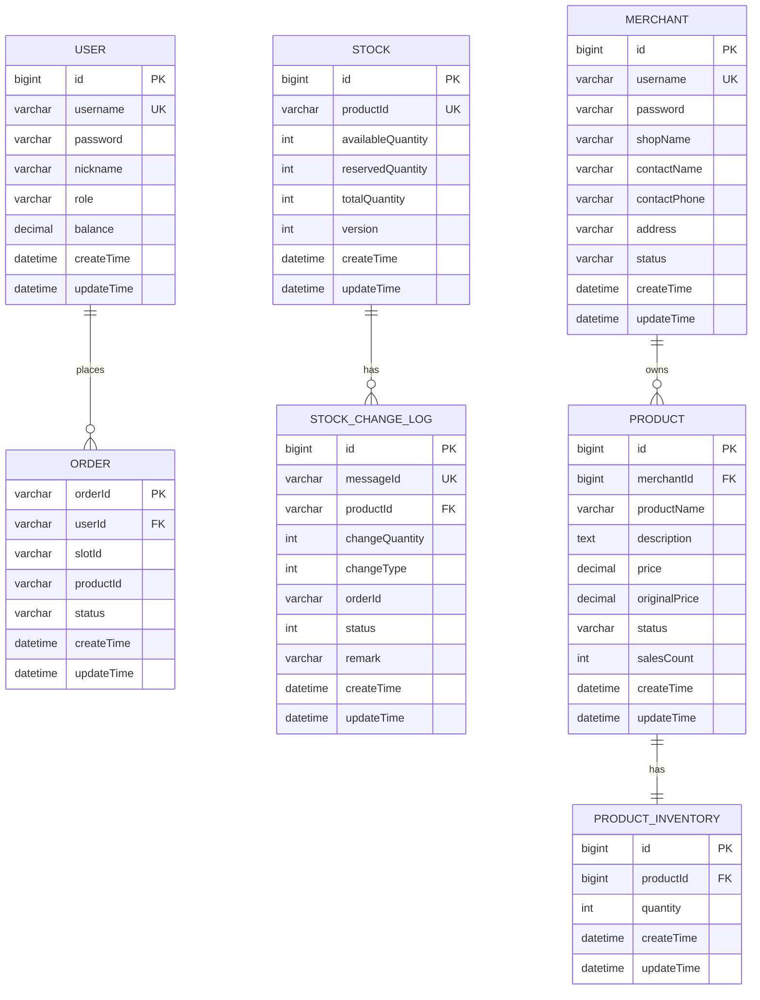

# WHUSingularity — Architecture Diagram

Microservice collaboration and data flow diagrams for the WHUSingularity high-concurrency flash-sale system.

---

## 1. System Overview — Component Diagram

---

## 2. Flash-Sale Order Flow — Sequence Diagram

The core high-concurrency path: user grabs an order (snag), distributed transaction commits, and both Order and Stock services consume the message.

---

## 3. Payment Flow — Sequence Diagram

After an order is created, the user pays, triggering a synchronous cross-service call via OpenFeign.

---

## 4. singularity-core Internal Architecture — Class Diagram

The custom high-concurrency allocation framework at the heart of the order service.

---

## 5. RocketMQ Topic & Consumer Group Map

---

## 6. Authentication Flow — JWT + Redis Blacklist

---

## 7. Data Model — Entity Relationship

