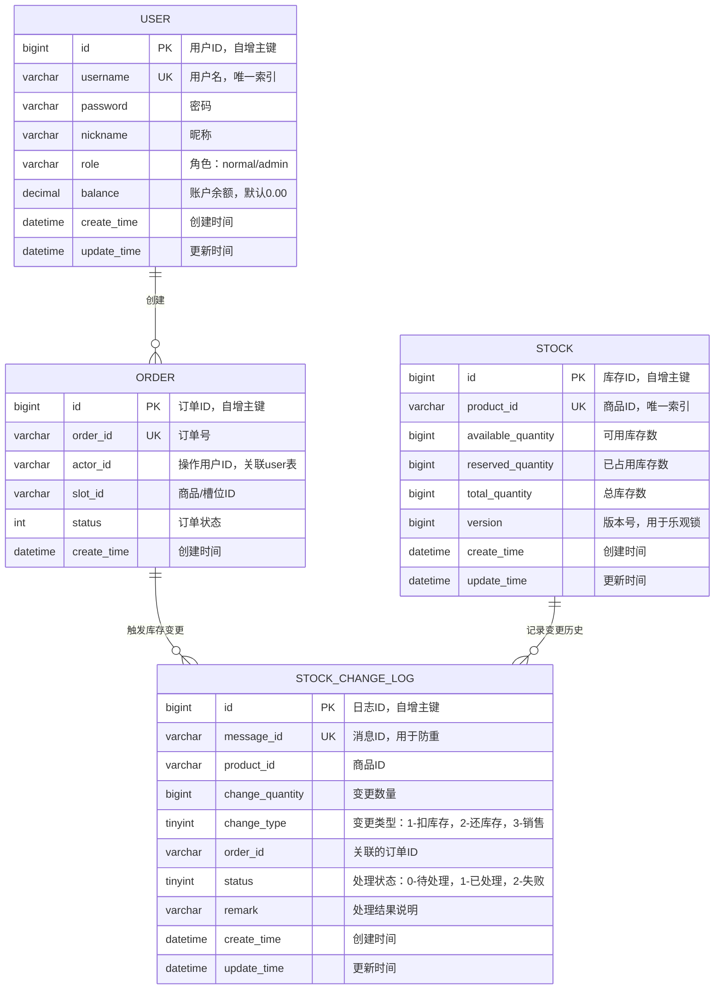

# 用户服务数据库 ER 图

## 实体说明

| 表名 | 说明 |
|------|------|
| USER | 用户表，存储用户基本信息和账户余额 |
| ORDER | 订单表，记录用户创建的订单 |
| STOCK | 库存表，管理商品库存信息 |
| STOCK_CHANGE_LOG | 库存变更日志表，记录所有库存变更事件 |

## 关系说明

- **USER** 1 -- * **ORDER**：一个用户可以创建多个订单
- **ORDER** 1 -- * **STOCK_CHANGE_LOG**：一个订单可以触发多条库存变更记录
- **STOCK** 1 -- * **STOCK_CHANGE_LOG**：一个商品的库存可以有多条变更历史
