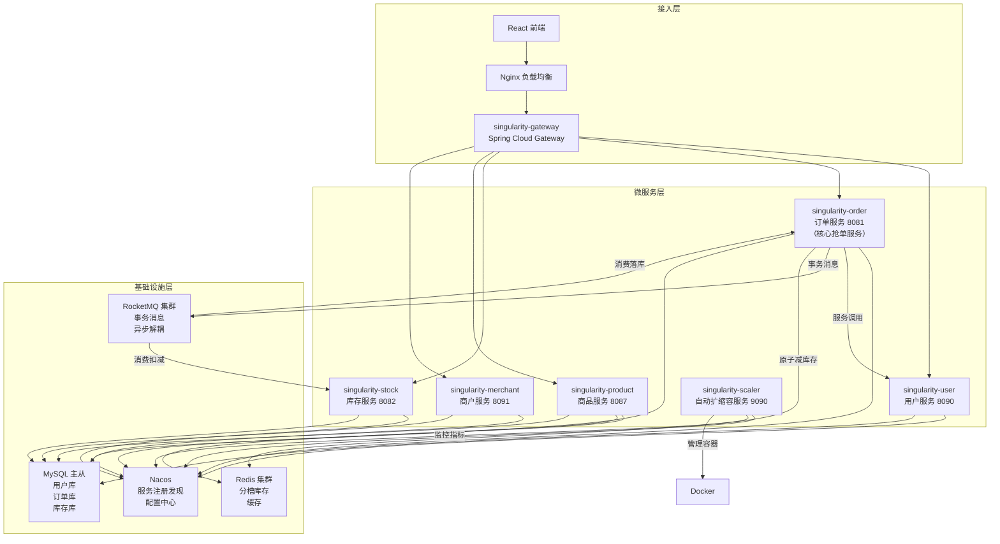
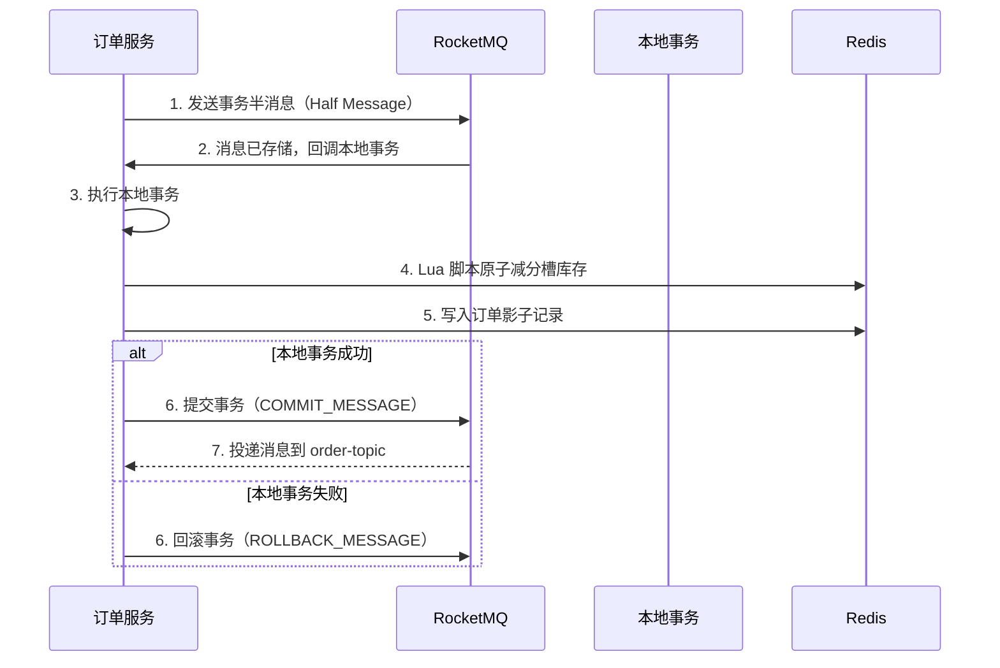

# WHUSingularity 高并发抢单系统 - 分布式系统需求文档

## 1. 项目概述

### 1.1 项目背景
WHUSingularity 是一个基于 Spring Cloud 微服务架构的高并发抢单系统，旨在解决电商场景下大规模用户同时抢购限量商品的技术挑战。该项目重点实现**高并发处理能力**、**分布式一致性保证**、**多级缓存架构**、**服务治理**等分布式系统核心技术。

### 1.2 核心技术目标

#### 高并发与高性能
- 支持百万级并发抢单请求
- 抢单接口 P99 响应时间 < 200ms
- 系统峰值 QPS ≥ 10万
- Redis 缓存命中率 ≥ 95%

#### 分布式一致性
- 基于 RocketMQ 事务消息实现最终一致性
- 保证订单创建和库存扣减的原子性
- 消息消费幂等性保证
- 乐观锁控制库存并发更新

#### 高可用与可扩展
- 系统可用性 99.9%（年度 downtime ≤ 8.76小时）
- 所有无状态服务支持水平扩展
- 自动扩缩容根据指标动态调整
- 服务隔离，单个服务故障不影响其他服务

### 1.3 技术栈

#### 微服务框架
- **Spring Boot 4.0.3**: 应用基础框架
- **Spring Cloud 2025.0.0**: 微服务框架
- **Alibaba Nacos 2.x**: 服务注册发现、配置中心
- **OpenFeign**: 服务间调用
- **Spring Cloud Gateway**: API 网关

#### 高并发与缓存
- **singularity-core**: 自研 Actor-Slot 高并发框架
- **Redis 6.0+**: 分布式缓存、分槽库存存储
- **Caffeine**: JVM 本地缓存
- **Lua 脚本**: Redis 原子操作

#### 消息队列与一致性
- **RocketMQ 4.9+**: 消息队列、事务消息
- **异步消费**: 订单落库、库存扣减异步化

#### 数据存储
- **MySQL 8.0+**: 持久化存储
- **MyBatis**: ORM 框架
- **Flyway**: 数据库迁移

#### 监控与运维
- **Actuator**: 端点暴露
- **Prometheus**: 指标采集
- **Docker**: 容器化部署
- **singularity-scaler**: 自研自动扩缩容服务

---

## 2. 分布式系统架构设计

### 2.1 整体架构



### 2.2 服务职责与分布式特性

| 服务名称 | 端口 | 核心职责 | 分布式特性 |
|---------|------|---------|-----------|
| singularity-gateway | 8080 | API 统一入口、路由转发、客户端负载均衡 | 服务路由、负载均衡、限流熔断（预留） |
| singularity-user | 8090 | 用户注册、登录、JWT 认证、Token 黑名单 | 分布式认证、黑名单共享（Redis） |
| singularity-order | 8081 | **抢单入口**、订单查询、Actor-Slot 路由、事务消息发送 | **高并发核心**、Actor-Slot 模型、RocketMQ 事务消息 |
| singularity-stock | 8082 | 库存持久化、Redis 分槽库存预热、异步扣减物理库存、库存变更日志 | **库存一致性**、最终一致性、分槽库存管理 |
| singularity-product | 8087 | 商品目录管理、搜索、列表 | **多级缓存**（Caffeine 本地 + Redis 远程）、缓存穿透保护 |
| singularity-merchant | 8091 | 商户认证、商品管理、库存管理 | 独立服务、独立 JWT、乐观锁库存更新 |
| singularity-scaler | 9090 | 自动扩缩容、监控指标采集、容器生命周期管理 | **水平扩展**、滑动窗口平滑、冷却期控制 |
| singularity-core | （库） | Actor-Slot 分槽路由、槽位管理、库存隔离 | **高并发框架**、锁竞争隔离 |

---

## 3. 核心分布式技术设计

### 3.1 Actor-Slot 分槽路由模型（高并发核心）

#### 3.1.1 设计背景
在传统秒杀系统中，大量并发请求同时竞争同一个库存资源，导致严重的锁竞争，系统吞吐量无法提升。

#### 3.1.2 分槽设计原理
将商品库存预先分成 N 个槽位（Slot），每个槽位存储一部分库存：

```
商品总库存 = 1000
槽位数量 = 10
每个槽位库存 = 100

槽位 0: [库存:100]
槽位 1: [库存:100]
...
槽位 9: [库存:100]
```

#### 3.1.3 Actor-Slot 路由算法
```java
// 将用户 ID 哈希到对应槽位
int slotId = hash(userId) % slotCount;
```

- 同一用户固定路由到同一槽位（幂等性）
- 不同用户分散到不同槽位（负载均衡）
- 每个槽位独立锁，锁竞争减少到 1/N

#### 3.1.4 分槽库存数据结构（Redis）
```
Key 设计:
- stock:{productId}:slot:{slotId}:available
- stock:{productId}:slot:{slotId}:locked
- stock:{productId}:slot:{slotId}:version

Value: 库存数量
```

#### 3.1.5 空槽位优化
当某个槽位库存为 0 时，标记为"空槽位"，后续请求直接拦截，避免无效的 Redis 访问。

---

### 3.2 RocketMQ 事务消息（分布式一致性核心）

#### 3.2.1 事务消息流程



#### 3.2.2 事务消息三阶段
1. **发送半消息**: 消息对消费者不可见
2. **执行本地事务**: 原子减 Redis 库存 + 写入影子记录
3. **提交/回滚消息**: 根据本地事务结果决定消息是否可见

#### 3.2.3 事务消息检查机制
当订单服务在提交/回滚阶段崩溃时，RocketMQ 会定期回查事务状态：

```java
// 回查逻辑
1. 从 Redis 读取订单影子记录
2. 如果记录存在 → 提交事务
3. 如果记录不存在 → 回滚事务
4. 超过一定次数 → 人工介入
```

---

### 3.3 Redis 原子操作（Lua 脚本）

#### 3.3.1 为什么需要 Lua 脚本？
Redis 的单个命令是原子的，但多个命令的组合不是原子的。Lua 脚本可以在 Redis 服务器端原子执行。

#### 3.3.2 原子减库存 Lua 脚本
```lua
-- KEYS[1]: 可用库存 Key
-- KEYS[2]: 锁定库存 Key
-- KEYS[3]: 版本号 Key
-- ARGV[1]: 扣减数量
-- ARGV[2]: 当前版本号

local available = redis.call('GET', KEYS[1])
if not available then
    return -1  -- 库存不存在
end

available = tonumber(available)
if available < tonumber(ARGV[1]) then
    return -2  -- 库存不足
end

local version = redis.call('GET', KEYS[3])
if not version or tonumber(version) ~= tonumber(ARGV[2]) then
    return -3  -- 版本号不匹配
end

-- 原子更新
redis.call('DECRBY', KEYS[1], ARGV[1])
redis.call('INCRBY', KEYS[2], ARGV[1])
redis.call('INCR', KEYS[3])

return 0  -- 成功
```

#### 3.3.3 乐观锁版本号机制
每次库存更新时递增版本号，并发更新时版本号校验失败则重试。

---

### 3.4 多级缓存架构（商品服务）

#### 3.4.1 缓存层级设计

```
读请求流程:
1. 先查 Caffeine 本地缓存（JVM 内，5分钟 TTL）
2. 本地缓存未命中 → 查 Redis 远程缓存（详情 30分钟，列表 10分钟）
3. Redis 未命中 → 查 MySQL 数据库
4. 回写缓存

写请求流程:
1. 更新 MySQL 数据库
2. 删除 Caffeine 本地缓存
3. 删除 Redis 远程缓存
```

#### 3.4.2 缓存穿透保护
当查询不存在的数据时，缓存一个 null 占位符，避免大量请求直接打到数据库：

```java
// 查询商品
public Product getProduct(Long productId) {
    // 1. 先查本地缓存
    Product product = caffeineCache.get(productId);
    if (product != null) {
        return product;  // 直接返回
    }

    // 2. 查 Redis
    String cacheKey = "product:" + productId;
    String json = redis.get(cacheKey);

    if ("NULL".equals(json)) {
        return null;  // 缓存穿透保护
    }

    if (json != null) {
        product = JSON.parseObject(json, Product.class);
        caffeineCache.put(productId, product);
        return product;
    }

    // 3. 查数据库
    product = productMapper.selectById(productId);

    if (product == null) {
        redis.setex(cacheKey, 60, "NULL");  // 缓存 null，60秒过期
    } else {
        redis.setex(cacheKey, 1800, JSON.toJSONString(product));  // 30分钟
        caffeineCache.put(productId, product);
    }

    return product;
}
```

---

### 3.5 最终一致性设计

#### 3.5.1 一致性模型选择
- **库存扣减**: Redis 强一致性（Lua 脚本原子操作）
- **订单落库 + 物理库存扣减**: 最终一致性（RocketMQ 异步消费）

#### 3.5.2 消息消费幂等性保证
每个消息都有唯一的 ID，消费前检查是否已消费：

```
幂等性机制:
1. 消息 ID 作为 Redis Key
2. 消费前检查 Key 是否存在
3. 不存在则消费，然后设置 Key（带过期时间）
4. 存在则跳过
```

#### 3.5.3 库存双写最终一致
```
时间线:
T0: Redis 分槽库存 = 100, MySQL 物理库存 = 100
T1: 抢单请求，Redis 原子减 1 → Redis 库存 = 99
T2: RocketMQ 事务提交
T3: 订单服务消费消息，订单落库
T4: 库存服务消费消息，MySQL 库存减 1 → MySQL 库存 = 99
T5: 最终一致
```

---

### 3.6 服务治理（Nacos）

#### 3.6.1 服务注册与发现
- 每个服务启动时向 Nacos 注册
- 服务间通过服务名调用，不依赖 IP 地址
- 客户端负载均衡（轮询/随机/加权）

#### 3.6.2 配置中心
- 业务配置集中存储在 Nacos
- 支持配置热更新，无需重启服务
- 配置优先级：Nacos > 本地 application.yml

#### 3.6.3 服务健康检查
- Nacos 定期心跳检查服务健康状态
- 不健康的服务自动从服务列表剔除

---

### 3.7 自动扩缩容（singularity-scaler）

#### 3.7.1 监控指标
从 Actuator + Prometheus 采集：
- CPU 使用率
- 内存使用率
- QPS（每秒请求数）
- 响应时间 P95/P99

#### 3.7.2 扩缩容决策算法
```java
// 滑动窗口平滑处理
List<Metric> recentMetrics = collectRecentMetrics(windowSize);
double avgCpu = recentMetrics.stream().mapToDouble(Metric::getCpuUsage).average();

// 扩容条件
if (avgCpu > 80 && currentInstances < maxInstances && cooldownPassed()) {
    scaleOut(1);  // 扩容 1 个实例
}

// 缩容条件
else if (avgCpu < 30 && currentInstances > minInstances && cooldownPassed()) {
    scaleIn(1);  // 缩容 1 个实例
}
```

#### 3.7.3 冷却期控制
每次扩缩容后进入冷却期（如 5分钟），避免频繁调整。

---

## 4. 核心功能需求（分布式视角）

### 4.1 高并发抢单流程（订单服务）

#### 4.1.1 接口说明
```
POST /api/order/snag
Headers: Authorization: Bearer {token}
Body: { "productId": 123 }
```

#### 4.1.2 详细流程

```mermaid
flowchart TB
    Start([开始]) --> Auth{用户认证}
    Auth -- 失败 --> Fail([返回失败])
    Auth -- 成功 --> Feign[OpenFeign 调用用户服务<br/>验证用户状态]
    Feign --> Slot[Actor-Slot 路由<br/>hash(userId) % slotCount]
    Slot --> HalfMsg[发送 RocketMQ 事务半消息]
    HalfMsg --> LocalTx{执行本地事务}
    LocalTx --> Lua[Lua 脚本原子减 Redis 分槽库存<br/>+ 版本号校验]
    Lua --> Shadow[写入订单影子记录到 Redis]
    Shadow --> TxResult{本地事务结果}
    TxResult -- 成功 --> Commit[提交事务消息]
    TxResult -- 失败 --> Rollback[回滚事务消息]
    Commit --> Consume1[订单服务消费消息<br/>订单落库 MySQL]
    Commit --> Consume2[库存服务消费消息<br/>异步扣减物理库存]
    Consume1 --> Success([返回成功 + orderId])
    Rollback --> Fail
```

#### 4.1.3 异常处理
- **用户认证失败**: 直接返回 401
- **库存不足**: 本地事务回滚，返回失败
- **版本号冲突**: 重试 3 次，仍失败则返回
- **消息发送失败**: 回滚本地事务，返回失败
- **消费失败**: 消息重试，超过次数进入死信队列

---

### 4.2 库存管理（库存服务 + 商户服务）

#### 4.2.1 库存预热（启动时）
```
流程:
1. 从 MySQL 读取商品总库存
2. 计算每个槽位的库存 = 总库存 / slotCount
3. 将分槽库存写入 Redis
4. 初始化版本号 = 0
5. 标记所有槽位为"可用"
```

#### 4.2.2 商户手动调整库存（乐观锁）
```java
@Transactional
public void adjustInventory(Long productId, int quantity, String remark) {
    // 1. 先读取当前库存和版本号
    ProductInventory current = inventoryMapper.selectByProductId(productId);
    int beforeQuantity = current.getTotalQuantity();
    int version = current.getVersion();

    // 2. 计算新库存
    int afterQuantity = beforeQuantity + quantity;
    if (afterQuantity < 0) {
        throw new BusinessException("库存不足");
    }

    // 3. 乐观锁更新（带版本号校验）
    int rows = inventoryMapper.updateWithVersion(
        productId, afterQuantity, version
    );
    if (rows == 0) {
        throw new BusinessException("并发更新冲突，请重试");
    }

    // 4. 记录变更日志
    inventoryChangeLogMapper.insert(new InventoryChangeLog(
        productId, "ADJUST", quantity, beforeQuantity, afterQuantity, remark
    ));
}
```

#### 4.2.3 库存变更日志
每次库存变更都记录日志，便于审计和问题追溯：
- 变更时间
- 变更类型（ADD/ADJUST/DEDUCT）
- 变更前后数量
- 操作人
- 备注

---

### 4.3 分布式认证（用户服务 + 商户服务）

#### 4.3.1 JWT 无状态认证
- 用户登录成功后签发 JWT Token
- Token 包含用户 ID、角色、过期时间
- 每个请求携带 Token，服务端验证签名

#### 4.3.2 Token 黑名单（Redis 共享）
```
场景: 用户主动登出、Token 被泄露
方案: 将 Token ID 存入 Redis，设置过期时间 = Token 剩余有效期
验证: 每次请求先检查 Token ID 是否在黑名单中
```

---

## 5. 数据一致性保证

### 5.1 库存一致性方案

| 层级 | 技术 | 一致性类型 | 说明 |
|------|------|-----------|------|
| 分槽库存（Redis） | Lua 脚本 + 乐观锁 | 强一致性 | 抢单时原子减库存 |
| 物理库存（MySQL） | RocketMQ 异步消费 + 幂等性 | 最终一致性 | 订单创建后异步扣减 |
| 商户手动调整（MySQL） | 乐观锁（version） | 强一致性 | 版本号校验防止并发更新 |

### 5.2 订单一致性方案

| 环节 | 技术 | 一致性保证 |
|------|------|-----------|
| 订单创建 + 库存扣减 | RocketMQ 事务消息 | 原子性保证 |
| 订单落库 | 消息消费 + 幂等性 | 至少一次送达 + 去重 |
| 订单状态流转 | 状态机 | 状态一致性 |

### 5.3 缓存一致性方案

| 操作 | 策略 | 说明 |
|------|------|------|
| 读取 | Cache-Aside | 先查缓存，未命中查数据库，回写缓存 |
| 更新 | Delete Cache | 先更新数据库，再删除缓存（不是更新） |
| 缓存穿透 | Null 占位符 | 缓存不存在的数据，防止打穿到数据库 |

---

## 6. 性能指标与测试

### 6.1 性能指标

| 指标 | 目标值 | 测量方式 |
|------|--------|---------|
| 并发能力 | 100万+ 并发请求 | k6 压测 |
| 抢单接口 P99 响应时间 | < 200ms | Prometheus Histogram |
| 系统峰值 QPS | ≥ 10万 | k6 压测 + Grafana 看板 |
| Redis 缓存命中率 | ≥ 95% | Redis info stats |
| 消息消费延迟 | < 1s | RocketMQ 监控 |
| 系统可用性 | 99.9% | Prometheus 可用性计算 |

### 6.2 压力测试方案

#### 6.2.1 测试工具
- **k6**: 高性能压测工具，支持脚本编写

#### 6.2.2 测试场景

**场景 1: 正常抢单（库存充足）**
```
- 并发用户: 10万
- 持续时间: 2分钟
- 预期结果: 大部分请求成功，QPS ≥ 5万
```

**场景 2: 库存不足（库存售罄）**
```
- 并发用户: 100万
- 商品库存: 1000
- 持续时间: 1分钟
- 预期结果: 只有 1000 个订单成功，其他快速失败
```

**场景 3: 冷启动（缓存未预热）**
```
- 初始状态: Redis 无缓存
- 并发用户: 1万
- 预期结果: 缓存逐步建立，性能逐渐提升
```

---

## 7. 部署架构

### 7.1 容器化部署（Docker + Docker Compose）
- 每个服务独立容器
- 服务之间通过 Docker 网络通信
- 配置通过环境变量注入

### 7.2 生产部署建议
- **Nacos 集群**: 至少 3 节点，保证高可用
- **Redis 集群**: 主从 + 哨兵，数据持久化（RDB + AOF）
- **RocketMQ 集群**: 多 NameServer + 多 Broker
- **MySQL**: 主从复制，读写分离
- **Gateway**: 多个实例，Nginx 负载均衡
- **应用服务**: 根据负载动态扩缩容

---

## 8. 监控与告警

### 8.1 核心监控指标

#### 系统层面
- CPU 使用率（按服务）
- 内存使用率（按服务）
- 磁盘使用率
- 网络流量

#### 服务层面
- QPS（每秒请求数）
- 响应时间（P50/P95/P99）
- 错误率
- 接口调用次数 TopN
- 服务健康状态

#### 业务层面
- 订单创建量（按分钟/小时）
- 成功订单数
- 失败订单数
- 库存预警（库存 < 阈值）
- 库存变更量

#### 缓存层面
- Redis 命中率
- Redis Key 数量
- Redis 内存使用量
- Caffeine 缓存命中率

#### 消息队列层面
- RocketMQ TPS
- 消息堆积量
- 消息消费延迟
- 死信队列消息数

### 8.2 告警规则

| 告警项 | 阈值 | 持续时间 | 级别 |
|--------|------|---------|------|
| CPU 使用率 | > 90% | 5分钟 | 紧急 |
| 内存使用率 | > 90% | 5分钟 | 紧急 |
| 错误率 | > 5% | 1分钟 | 警告 |
| 响应时间 P99 | > 500ms | 2分钟 | 警告 |
| 消息堆积 | > 1000条 | 5分钟 | 警告 |
| 库存预警 | < 100 | 0分钟（立即） | 警告 |

---

## 9. 技术亮点总结

| 技术点 | 应用场景 | 解决的问题 |
|--------|---------|-----------|
| Actor-Slot 分槽模型 | 抢单路由 | 减少锁竞争，提升并发能力 |
| Redis 分槽库存 + Lua 脚本 | 库存扣减 | 原子性操作，高性能 |
| RocketMQ 事务消息 | 订单创建 | 分布式一致性保证 |
| 多级缓存（Caffeine + Redis） | 商品查询 | 高性能读，减少数据库压力 |
| 乐观锁（version） | 库存调整 | 并发更新冲突控制 |
| 消息消费幂等性 | 异步消费 | 重复消息处理 |
| Nacos 服务治理 | 微服务架构 | 服务发现、配置中心 |
| 自动扩缩容 | 弹性伸缩 | 根据负载动态调整资源 |

---

## 10. 后续优化方向

### 10.1 短期优化
- 实现接口限流熔断（Sentinel 或 Resilience4j）
- 完善订单状态机（支付、取消、发货、完成）
- 添加分布式事务消息补偿机制

### 10.2 中长期优化
- 数据库分库分表（订单表按用户 ID 或时间分表）
- Redis Cluster 集群化（当前单实例）
- 实现读写分离（订单查询走从库）
- 链路追踪（SkyWalking 或 Jaeger）
- 全链路压测与性能调优

---

## 附录

### A. 术语表
| 术语 | 说明 |
|------|------|
| Actor-Slot | 基于 Actor 模型的分槽路由机制，将请求路由到不同库存槽 |
| 分槽库存 | 将库存分成多个槽位，不同请求路由到不同槽，减少锁竞争 |
| 事务消息 | RocketMQ 提供的事务消息机制，保证本地事务和消息发送的原子性 |
| 最终一致性 | 分布式系统中，经过一段时间后数据最终达到一致 |
| 乐观锁 | 数据版本号机制，更新时校验版本，冲突则重试或失败 |
| 幂等性 | 同一操作执行多次结果相同 |
| 多级缓存 | Caffeine 本地缓存 + Redis 远程缓存的两层缓存架构 |
| 影子记录 | 用于事务检查的临时记录，存储在 Redis 中 |
| 缓存穿透 | 查询不存在的数据，导致请求直接打到数据库 |

### B. 参考资料
- [Spring Cloud 官方文档](https://spring.io/projects/spring-cloud)
- [Nacos 官方文档](https://nacos.io/zh-cn/docs/what-is-nacos.html)
- [RocketMQ 官方文档 - 事务消息](https://rocketmq.apache.org/zh/docs/featureBehavior/04transactionmessage)
- [Redis Lua 脚本](https://redis.io/docs/interact/programmability/eval-intro/)
- [分布式系统设计模式](https://www.bookstack.cn/read/Distributed-System/d4c37a8d3a19958d.md)

---

**文档版本**: v2.0（分布式系统专项版）
**最后更新**: 2026-05-09
**维护者**: WHUSingularity 团队
